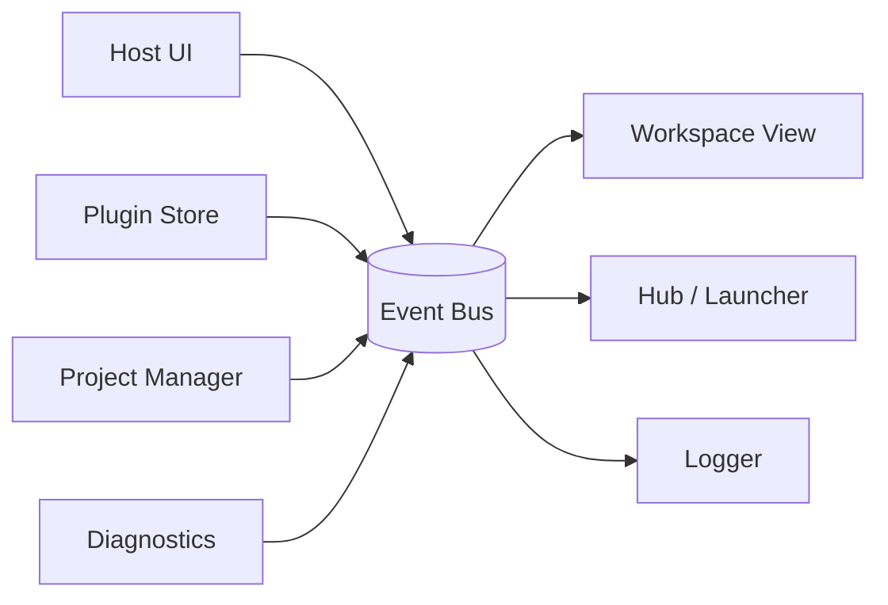
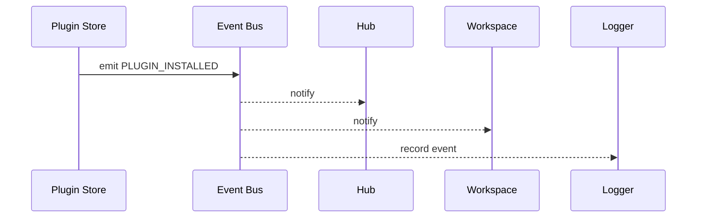

# Core Architecture Overview

Karcytics uses a modular, event-driven architecture to keep the main application stable while allowing plugins, workspaces, and project tooling to react to changes without hard dependencies on one another.

---

## Why this architecture exists

At a high level, Karcytics separates three concerns:

* the host application (core UI, project state, navigation)
* plugin modules (analysis tools and workflows)
* the project state and history layer (save, undo, restore, snapshots)

This matters because the app needs to react to things like plugin installation, theme changes, project opens, and diagnostics without creating fragile, tightly coupled object graphs.



---

## Core idea: decoupled communication

The event bus lets components communicate by publishing events instead of calling each other directly. This keeps subsystems loosely coupled and makes it easier to add new workflows.

Example:

* the Plugin Store installs a module,
* it emits `PLUGIN_INSTALLED`,
* the Hub refreshes its module list,
* the workspace could update its actions,
* the logger records the event,
* none of those components need direct references to one another.



---

## Event bus implementation

The global bus is a singleton held in `karcytics.core.event_bus`.

### Event types

Events are strongly typed through a central enum, which makes the system safer than using plain strings.

| Event | Trigger condition | Expected payload |
| :--- | :--- | :--- |
| `PLUGIN_INSTALLED` | a verified plugin is added | `plugin_id: str` |
| `PLUGIN_REMOVED` | a plugin is removed | `plugin_id: str` |
| `PROJECT_LOADED` | a project is opened | `path: str` |
| `THEME_CHANGED` | the UI theme changes | `theme_name: str` |
| `ERROR_OCCURRED` | a diagnostic event is emitted after an exception | `error_context: dict` |

### Subscribing to events

```python
from karcytics.core.event_bus import event_bus, KarcyticsEvent


class MyDashboard(QWidget):
    def __init__(self):
        super().__init__()
        event_bus.subscribe(KarcyticsEvent.PLUGIN_INSTALLED, self._on_plugin_added)

    def _on_plugin_added(self, plugin_id: str):
        self.refresh()
```

### Emitting events

Event emission is designed to be thread-safe and UI-safe.

```python
def install_plugin(plugin_id: str):
    # Perform background tasks...
    event_bus.emit(KarcyticsEvent.PLUGIN_INSTALLED, plugin_id)
```

Karcytics uses Qt signal queuing so callbacks are delivered on the main UI thread, avoiding cross-thread UI access errors.

---

## Plugin isolation and cross-process boundaries

The in-process event bus is only part of the story. An isolated plugin runs in a separate OS process and does not directly touch the host event bus.

Instead, the system uses a bridged event path for specific topics. This keeps the host and plugin runtime separated while still allowing controlled communication for relevant events.

This is especially important for the plugin model described in the communication protocol and event bridging docs:

* direct host-to-plugin calls are intentionally limited,
* only scoped events are bridged,
* the bus stays inside the host process and does not become a blanket channel for every plugin action.

---

## Diagnostic engine

Karcytics includes a diagnostic layer for runtime tracking and crash reporting.

### In-memory buffer

The engine keeps a ring buffer of recent system events, requests, and state changes. This gives the app a compact history of recent activity without writing a full log on every tiny event.

### Global exception handling

When an unhandled exception occurs, the system can:

1. freeze the current diagnostic buffer,
2. serialize a crash report,
3. emit an `ERROR_OCCURRED` event,
4. route that data to the logger or support tooling.

### Plugin logging integration

Plugins using the standard logging interfaces can pipe their logs into the same diagnostic pathway, which helps with troubleshooting and support cases.

---

## Thread-safe dispatch details

The event manager uses Qt’s signal system to queue work safely.

```python
class EventManager(QObject):
    _internal_bus = pyqtSignal(KarcyticsEvent, tuple, dict)

    def emit(self, event_type, *args, **kwargs):
        self._internal_bus.emit(event_type, args, kwargs)
```

This pattern ensures that background worker threads can publish events without directly touching the UI thread; the Qt event loop handles the delivery order.

---

## Why this matters

A clean event-driven core makes Karcytics easier to evolve:

* new UI surfaces can subscribe without wiring tight dependencies,
* plugin installation and project changes can trigger coordinated updates,
* diagnostics stay centralized and easier to inspect,
* the architecture is compatible with isolated plugin execution and safer system boundaries.

For most contributors, the most important mental model is simple: the core uses events to announce state changes, and subscribers react to those changes without owning each other’s implementation.
