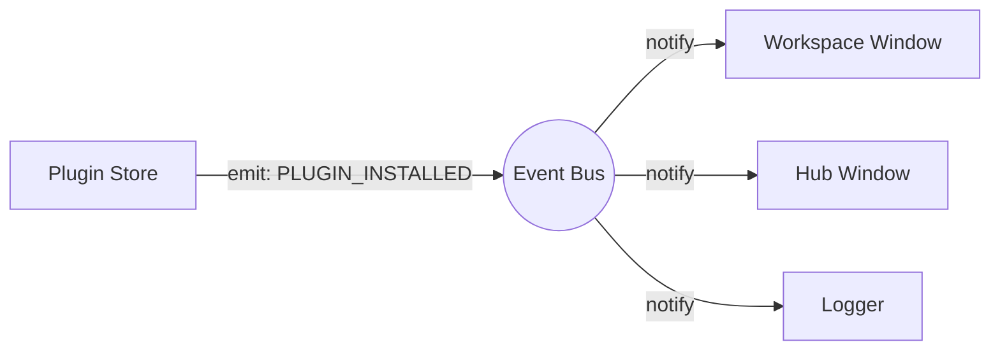

# Core Architecture Overview (Event Bus)

Karcytics utilizes an Event-Driven Architecture (EDA) to decouple system components. Modules such as the Plugin Store, Workspace, and Core Storage communicate via a central event bus rather than direct method invocations.

---

## Architectural Rationale

Decoupling components prevents tightly coupled dependencies. For instance, the Plugin Store does not require a direct reference to the Workspace Window to trigger a UI refresh after a plugin installation. Instead, it emits a `PLUGIN_INSTALLED` event, and any interested component can subscribe and react independently.



---

## The Event Bus Implementation (`karcytics.core.event_bus`)

The global event bus is instantiated as a singleton `event_bus`.

### 1. The `KarcyticsEvent` Enumeration
Events are strongly typed using a central `Enum` to prevent string-matching errors and enable static analysis.

| Event | Trigger Condition | Expected Payload |
| :--- | :--- | :--- |
| `PLUGIN_INSTALLED` | A plugin package is added and verified. | `plugin_id: str` |
| `PLUGIN_REMOVED` | A plugin package is deleted. | `plugin_id: str` |
| `PROJECT_LOADED` | A `.karcytics` project is opened. | `path: str` |
| `THEME_CHANGED` | The global UI theme is updated. | `theme_name: str` |
| `ERROR_OCCURRED` | An error is intercepted by the Diagnostic Engine. | `error_data: dict` |

*(Additional events exist for system states, Academy tracking, and user actions. See `event_bus.py` for the full enumeration.)*

### 2. Subscribing to Events
UI components typically register their callbacks during initialization.

```python
from karcytics.core.event_bus import event_bus, KarcyticsEvent


class MyDashboard(QWidget):
    def __init__(self):
        super().__init__()
        event_bus.subscribe(KarcyticsEvent.PLUGIN_INSTALLED, self._on_plugin_added)

    def _on_plugin_added(self, plugin_id: str):
        self.refresh()
```

### 3. Emitting Events
Event emission is thread-safe. Karcytics utilizes PyQt6's signal queuing mechanism to ensure callbacks are executed on the Main UI Thread, preventing cross-thread UI updates.

```python
def install_plugin(id):
    # Perform background tasks...
    event_bus.emit(KarcyticsEvent.PLUGIN_INSTALLED, id)
```

---

## Reaching an isolated plugin

Everything above is this process's own in-memory bus — an isolated plugin
(`process_model = "isolated"`, see `docs/internal/24_Plugin_Communication_Protocol.md`)
runs in a separate OS process and never touches `event_bus` directly. It can
still opt into hearing a specific `KarcyticsEvent` topic via
`docs/internal/28_Event_Bridging.md`'s `event.subscribe`/`dispatch_event`
bridge — scoped per topic, not a blanket forward of everything emitted here.

## Diagnostic Engine

Karcytics includes a `karcytics.core.diagnostics` module for error tracking and application state logging.

### 1. In-Memory Event Buffer
The engine maintains a ring buffer of the most recent system events, network requests, and state transitions.

### 2. Error Reporting and Interception
The core intercepts errors in two primary ways:
1. **AutoReportHandler**: A custom logging handler automatically forwards any `ERROR` or `CRITICAL` log directly to the `DiagnosticEngine`.
2. **Global Exception Hook**: Unhandled exceptions are caught by overriding `sys.excepthook`.

When a fatal error occurs:
1. The event buffer is frozen.
2. The stack trace and the buffer contents are sent to the crash reporter (e.g., Sentry) if consent is given.
3. The `ERROR_OCCURRED` event is emitted to notify the UI.

### 3. Plugin Logging Integration
Plugins utilizing the standard `karcytics.sdk.utils.logging` interface have their logs automatically piped into the diagnostic buffer.

---

## Thread-Safe Dispatch Details

The `EventManager` leverages a specialized internal `pyqtSignal`.
Invoking `emit()` from a background worker thread queues the signal within the Qt Event Loop. It is dispatched sequentially when the Main Thread processes its queue, preventing concurrent access violations on GUI elements.

```python
class EventManager(QObject):
    _internal_bus = pyqtSignal(KarcyticsEvent, tuple, dict)

    def emit(self, event_type, *args, **kwargs):
        self._internal_bus.emit(event_type, args, kwargs)
```
