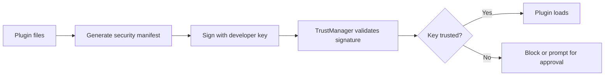

# Security and Code-Signing Guide

This document explains how Karcytics verifies plugin integrity, how signing works for developers, and how to integrate signing and trust checks into a release workflow.

---

## Security model at a glance

Karcytics uses asymmetric cryptography to verify that a plugin:

* was created by the expected developer,
* has not been modified since it was signed,
* matches the declared trust path or local approval state.

The core validation relies on the developer signature (`signature.bin`) generated over the canonical byte representation of the `security.json` ledger. Some organizations also require a project-level co-signature (`project_signature.bin`) to validate CI and release compliance.



---

## Generating Ed25519 keys

Developers need an Ed25519 keypair before they can sign plugins.

### Using the CLI

```bash
karcytics-sdk init-identity
```

This creates a public/private keypair for the developer identity.

### Programmatic generation

If you want to integrate signing into automation, use Python’s `cryptography` library:

```python
from cryptography.hazmat.primitives.asymmetric import ed25519
from cryptography.hazmat.primitives import serialization

private_key = ed25519.Ed25519PrivateKey.generate()
public_key = private_key.public_key()
# ... handle serialization ...
```

---

## Author profiles and RBAC

The `manifest.json` file describes which authors are required to sign the plugin. This is the trust boundary for module execution.

### RBAC constraints

* Authors with the `"sign_code"` permission must sign the plugin.
* Authors without that permission are not required to provide a cryptographic signature.
* If a required signer is missing or the signature is invalid, verification fails before the plugin can load.

```json
{
  "manifest_version": 2,
  "id": "analysis_module",
  "authors": [
    {
      "name": "Primary Developer",
      "permissions": ["sign_code"]
    }
  ]
}
```

---

## Signing workflow

Before distributing a plugin, generate the manifest and sign the package.

```bash
karcytics-sdk sign <plugin_dir>
```

This process hashes the plugin files and creates a signed ledger (for example, `security.json` and `signature.bin`) that the runtime validates before loading the module.

---

## Project-level signing in CI/CD

To reduce the risk of manual errors or unreviewed release artifacts, many teams add a second signature during CI. This is especially useful for institution-managed or release-pipeline workflows.

### Example GitHub Actions step

```yaml
- name: Execute Project Signing
  env:
    KARCYTICS_PROJECT_PRIVATE_KEY: ${{ secrets.KARCYTICS_PROJECT_PRIVATE_KEY }}
  run: |
    for dir in plugins/*/; do
      if [ -d "$dir" ]; then
        karcytics-sdk project-sign "$dir"
      fi
    done
```

This allows release automation to validate the build using a project identity instead of relying only on a developer key.

---

## Trust flow for end users

Karcytics ultimately answers one question: “Should this plugin be allowed to run on this machine?”

The trust decision can come from:

* a known remote authority or registry,
* a trusted local key in `~/.karcytics/trusted_roots`,
* an explicit trust prompt the user approves.

If the trust chain is missing or broken, Karcytics blocks execution or requires a trust decision before continuing.

---

## Best practices

* keep signing keys in a secure secret store and never commit private keys to the repo,
* rotate keys when a developer leaves the team or a release pipeline changes,
* validate plugin signatures during CI before publishing,
* treat untrusted plugins as blocked by default rather than “safe because the file exists.”

---

## Related docs

* [Developer Onboarding](19_Developer_Onboarding.md) — developer setup and contribution workflow
* [Plugin Store & Security](../user/07_Plugin_Store_and_Security.md) — how end users manage trust and plugin safety
* [Security and Trust Architecture](../user/10_Security_and_Trust.md) — end-user perspective on verification and trust
