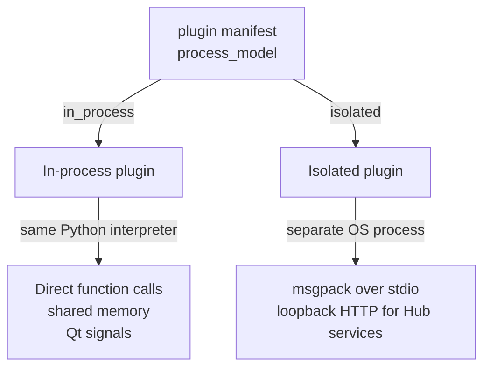
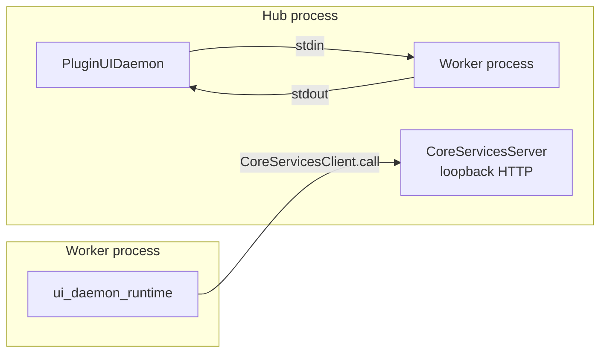

# Plugin Communication Protocol

This page explains how Karcytics talks to plugins running in different execution modes. The key idea is simple: some plugins run inside the host process, while others run in a separate worker process with a controlled boundary.

---

## Execution models

Karcytics supports two plugin execution models, selected per plugin in its manifest:



The manifest setting is stored under `[tool.karcytics.plugin]` and defaults to `in_process`. In practice, isolation is opt-in and usually reserved for plugins that need their own dependency set or runtime isolation.

---

## In-process plugins

In-process plugins share the Hub interpreter. This is the default path and is the easiest model for plugin authors because the plugin can call into Hub objects and use the same Qt event loop.

### Loading model

Two in-process loading paths exist:

* V3 entry-point loading: the plugin declares an entry point such as `module:function`, and the Hub imports that function and executes it with a `PluginContext`.
* V2 legacy loading: the plugin is imported as a namespace package and must satisfy the `KarcyticsPlugin` protocol.

Before the object is imported, Karcytics adds the plugin’s own environment to `sys.path`, so the plugin can resolve its own dependencies even while running in the same interpreter.

### Plugin context

The plugin receives a `PluginContext` with a limited set of capabilities declared in the manifest. This is a security and clarity boundary: undeclared capabilities are not available.

```python
services = {
    "task_scheduler": task_scheduler,
    "logger": logging.getLogger(f"plugin.{module_id}"),
}
context = PluginContext(services=services, manifest=manifest)
```

### Threading

In-process plugin UI runs on the Hub’s Qt main thread. Background work is typically dispatched through the Hub task scheduler, which uses Qt signals to marshal work back to the UI thread safely.

This model is simple and fast, but it means the plugin must respect the same UI rules as the core app.

---

## Isolated plugins

Isolated plugins run in their own OS process with their own Python environment. This avoids dependency conflicts and gives the host a tighter execution boundary for plugins that need stronger separation.

### Process topology



The worker process is launched with the plugin’s own interpreter and environment, while the Hub exposes a small set of controlled services through a loopback HTTP server. This is the boundary between host concerns and plugin runtime concerns.

### Channel 1: stdio control pipe

Karcytics uses a framed msgpack protocol over stdio to send requests and responses between the Hub and the isolated worker.

Frame format:

```text
[4-byte big-endian payload length][msgpack payload]
```

The payload contains a dict with a `kind` field. Common shapes include:

| kind | direction | purpose |
|---|---|---|
| `request` | Hub → worker | call a method and wait for a response |
| `response` | worker → Hub | answer to a pending request |
| `event` | either direction | fire-and-forget notification |

This is the main command and control channel for worker startup, window lifecycle, focus, theme updates, and workflow injection.

### Channel 2: loopback CoreServicesServer

The Hub also exposes a local-only RPC surface over `127.0.0.1` using a random free port and a generated bearer token. This allows the worker to call back into hub services such as:

* diagnostics reporting
* theme lookup and switching
* about/help metadata

The important part is that this is intentionally limited to a small, explicit service surface instead of unrestricted host access.

---

## Why the protocol is intentionally strict

The protocol is designed to avoid accidental overreach:

* in-process plugins share the same interpreter and have fewer boundaries,
* isolated plugins use a controlled RPC surface to keep the host safe,
* event bridging is explicit and topic-scoped, instead of forwarding everything blindly,
* the worker has a narrow, declared interface instead of full unrestricted host access.

This reduces confusion and prevents subtle issues where a worker accidentally receives a mismatched message type or a host service gets called without an expected contract.

---

## Known failure modes worth avoiding

A few protocol mismatches are especially dangerous:

* sending an event frame where a request is expected,
* assuming worker-side event delivery is the same as request/response flow,
* treating a “request accepted” response as “the task completed,”
* forwarding too much host state across the boundary instead of explicit, minimal data.

The protocol and worker runtime are designed to make these cases explicit rather than silent.

---

## Practical guidance for contributors

When building or extending a plugin, choose the simplest execution model that matches the requirement:

* use `in_process` by default for simple, same-runtime modules,
* use `isolated` when dependency isolation or tighter runtime boundaries matter,
* keep cross-process messages narrow, typed, and explicit,
* treat the worker lifecycle and RPC boundaries as part of the plugin contract, not an implementation detail.

---

## Related docs

* [Core Architecture Overview](11_Core_Nervous_System.md)
* [Event Bridging](28_Event_Bridging.md)
* [Server / Client Lifecycle](26_Server_Client_Lifecycle.md)
