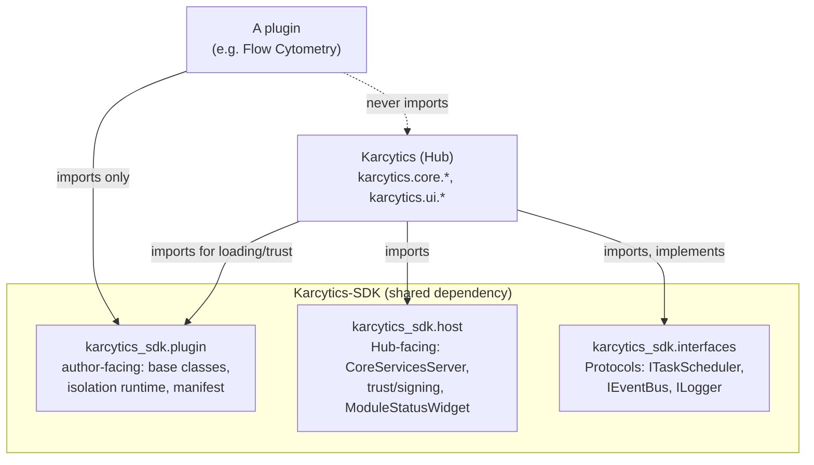

# Core & SDK Boundary, and Migration Status

Two separate repos, two separate packages, one running application:

- **`Karcytics`** (this repo) — the Hub application itself. Owns the window
  you open, the theme system, project files, and the concrete
  implementations of every core service.
- **`Karcytics-SDK`** (`karcytics_sdk` on disk, imported as
  `karcytics_sdk.*`) — a standalone, independently-versioned package that
  *both* the Hub and every plugin depend on. It is the only thing a plugin
  is allowed to import from outside its own code.

That last arrow — a plugin never importing `karcytics.*` — isn't a style
preference, it's load-bearing. It's *why* process isolation
(docs/internal/24) is even possible for a compliant plugin: a plugin that
only ever depended on `karcytics_sdk` never had a hard dependency on the
Hub's interpreter to begin with, so running it in a separate process instead
is a deployment change, not a rewrite. (Confirmed empirically, not just by
convention: grepping the Flow Cytometry plugin's source for
`from karcytics.ui` or `import karcytics.ui` returns zero hits.)

---

## What Karcytics (Core) provides

| Area | Where | What |
|---|---|---|
| Plugin discovery, trust orchestration, loading | `core/plugins/` (`discovery.py`, `loader.py`, `environment.py`), `core/module_manager.py` | Finds plugins on disk, asks `TrustManager` to verify them, imports/instantiates them (V2/V3 — see below), owns their lifecycle |
| Task scheduling | `core/task_scheduler.py:18` | `TaskScheduler(QObject)` — the real `QThreadPool`-backed singleton, the concrete implementation behind `ITaskScheduler` |
| Event bus | `core/event_bus.py:58` | `EventManager(QObject)` — the real pub/sub singleton, the concrete implementation behind `IEventBus` |
| Diagnostics | `core/diagnostics.py` | Central error reporting/dialog |
| Preferences | `core/preferences.py` | Settings persistence |
| Project lifecycle | `core/projects/` (`manager.py`, `locking.py`, `workflows.py`, `assets.py`) | Project files, locking, workflow/session persistence |
| Registry/update/marketplace | `core/network/`, `network_updater.py`, `update_checker.py`, `sbom.py` | Fetches the plugin registry, installs/updates plugins |
| Theme system | `ui/theme.py` | The live `Colors` class and `theme_manager` singleton every Hub widget styles against |
| All Hub chrome | `ui/windows/`, `ui/dialogs/`, `ui/components/`, `ui/dashboards/`, `ui/wizards/`, `ui/widgets/`, `ui/tabs/` | Home screen, workspace window, every dialog, every Hub-branded widget — plugins never touch any of this directly |
| Wiring the SDK's services into this specific app | `core/core_services_bootstrap.py` | Starts the SDK's `CoreServicesServer` and registers *this app's* handlers on it (`diagnostics.report_error`, `theme.*`) — the glue, not the mechanism |

`karcytics/plugins/` (note: no `core.`) deserves a callout on its own — it's
nearly empty (`__init__.py`, `sdk_utils.py`). It exists purely as the target
namespace package that V2 legacy plugins get imported into
(`karcytics.plugins.{package_name}`); it is not where plugin implementations
live.

## What Karcytics-SDK provides

### `karcytics_sdk.plugin` — what a plugin author builds with

- **Base classes / UI framework**: `base.py` (`PluginBase`, undo/redo +
  state wiring), `analysis.py` (`AnalysisBase` — pure computation, no Qt),
  `wizard.py` (step-based wizard UI), `state.py` (`PluginState`),
  `workflow.py`, `validation.py`, `signals.py`, `events.py` (a standalone
  `EventBus` a plugin can use for its own internal pub/sub — distinct from
  the Hub's `EventManager`), `preferences.py`, `managed_task.py`,
  `interfaces.py` (the `KarcyticsPlugin` protocol V2 legacy plugins satisfy),
  `logging.py`.
- **Shared, theme-aware widgets** so a plugin's UI looks native to the Hub
  without importing `karcytics.ui`: `components.py` (the `Bio*` family —
  `BioButton`, `BioComboBox`, `ModuleCard`, etc.), `ribbon.py`, `dialogs.py`,
  `io.py`.
- **The isolation runtime** (docs/internal/24 covers this in full):
  `daemon.py`, `ui_daemon_runtime.py`, `runtime_services.py`, `context.py`,
  `theme_fallback.py`, `galactic_loader.py` (+ `.qml` — one canonical asset
  shared by both the Hub's and the SDK's own Python wrapper, kept as two
  explicit ~20-line classes rather than one shared class routed through a
  runtime environment check).
- **Manifest/packaging**: `manifest.py` (`PluginManifest`), `manifest_parser.py`,
  `security_parser.py`.

### `karcytics_sdk.host` — what the Hub imports *from* the SDK

Nothing here imports `karcytics.*` — this is code the Hub depends on, not
code that depends on the Hub:

- `core_services.py` — `CoreServicesServer`/`CoreServicesClient` (the
  mechanism; the Hub supplies the handlers via `core_services_bootstrap.py`).
- `module_status_widget.py` — the Hub-owned placeholder for a running
  isolated module.
- `qt_bridge.py` — lets a background server thread safely run something on
  the Qt main thread.
- `trust_manager.py`, `trust_storage.py`, `trust_path.py`, `trust_overrides.py`,
  `sign_plugin.py` — the full Ed25519 signing/verification engine: a
  distributed plugin must chain to the Karcytics Core Authority root key (or
  a project CI key, or an explicit local override) and pass a per-file
  SHA-256 integrity check against a signed `security.json` ledger before
  `module_manager.py` will load it. Root key:
  `trust_manager.py:28-29` (`KARCYTICS_ROOT_PUBLIC_KEY_HEX`, rotatable).
  Result codes (`verified_developer`, `verified_project`, `verified_local`,
  `untrusted`, `outdated`, ...) are produced by
  `karcytics/core/trust/strategies.py` — the *decision* is a Core concern,
  the cryptographic *verification primitives* are an SDK concern.
- `ai.py`, `docs.py`, `marketplace_cache.py` — Gemma AI integration, the
  plugin help-page registry, and sandboxed marketplace caching.

### `karcytics_sdk.interfaces` — the dependency-inversion seam

`i_task_scheduler.py` (`ITaskScheduler`), `i_event_bus.py` (`IEventBus`),
`i_logger.py` (`ILogger`) — `runtime_checkable` `Protocol`s, no
implementation. This is the whole point of the SDK/Core split expressed as
code: a plugin (or the SDK itself) can type against "something that behaves
like a task scheduler" without ever importing the class that actually is
one. Core provides the concrete singletons at runtime; the SDK never needs
to import Core to describe the contract.

### `karcytics_sdk.cli` — developer tooling

The `karcytics-sdk` console script (`cli/main.py` → `cli/commands/*.py`):

| command file | does |
|---|---|
| `scaffold.py` | `create-manifest`, `bootstrap`, `init` — generate a manifest or a full plugin skeleton |
| `security.py` | `init-identity`, `sign`, `project-sign` — generate a dev Ed25519 identity, sign a plugin |
| `diagnostics.py` | `sbom`, `evaluate`, `doctor` — SBOM generation, plugin health checks |
| `migrate.py` | `migrate` — converts a legacy `manifest.json` plugin to the current `pyproject.toml` layout |

### `karcytics_sdk.testing`

`contract.py` — `ContractTestBase`, a pytest base class a plugin author
subclasses to get `test_manifest_is_valid` and `test_headless_initialization`
for free (the latter mocks every capability the manifest declares and
confirms the plugin's `entry_point` resolves and initializes without a
running Hub at all).

---

## Where UI comes from, where analysis comes from — the short answer

- **The Hub's own chrome** (home screen, workspace window, every dialog,
  theming) — entirely `karcytics/ui/*`, in this repo. No plugin touches it.
- **A plugin's own UI** — the plugin's own code, built from
  `karcytics_sdk.plugin.components`' `Bio*` widget library so it inherits
  the Hub's visual language without importing anything Hub-specific. An
  isolated plugin additionally gets `GalacticLoader` (the startup animation)
  and a generated menu bar from `ui_daemon_runtime.py` for its native window
  — the Hub's own menu bar and chrome are not reachable from inside an
  isolated window at all, by construction.
- **Analysis/computation** — always the plugin's own code
  (`AnalysisBase` subclasses). *Where it executes* depends on the process
  model: an in-process plugin's `AnalysisBase` runs on the Hub's shared
  `TaskScheduler` (`QThreadPool`); an isolated plugin's runs on a scheduler
  local to its own process, and — as Flow Cytometry demonstrates — a plugin
  can go a level further and push heavy computation into a *second*
  subprocess of its own (`analysis/daemon_worker.py`), using the same
  `PluginDaemon` machinery the Hub uses to talk to the plugin's window
  process. Either way, the Hub's own interpreter never runs a plugin's
  numerics directly once isolation is in play.

---

## Migration status — what's still unfinished

1. **Two plugin-loading paths coexist, deliberately.** V3
   (`entry_point` + `PluginContext`) is the current path; V2 legacy
   (`KarcyticsPlugin` protocol, whole-package import into the
   `karcytics.plugins` namespace) still loads and is not scheduled for
   removal on its own — it's the fallback for plugins that predate V3. V1
   (`author`-field manifests) is fully dead: discovered only to explain why
   it's rejected (`OutdatedModuleError`), never loaded.
2. **`event_bus` is a real, still-open gap for in-process plugins — now loud,
   not silent.** `PluginContext`'s services dict for a V3 plugin
   (`core/plugins/loader.py:84-88`) no longer has an `"event_bus"` key at
   all. A plugin that doesn't declare `requires = ["event_bus"]` is
   unaffected; one that does gets `PluginContext.get()`'s existing
   declared-but-unavailable `RuntimeError` the moment it calls
   `context.get("event_bus")`, instead of silently receiving `None` and
   failing later, more confusingly, the first time it calls a method on it.
   The underlying gap — no real `EventManager` wired to in-process V3
   plugins — is unchanged; only the failure mode is fixed.
3. **Isolation is opt-in, and only one plugin uses it.** `process_model`
   defaults to `"in_process"` — every plugin keeps its current behavior
   unless it explicitly asks for isolation. Flow Cytometry is the only
   isolated plugin as of this writing; docs/internal/24's protocol has only
   really been exercised by one real workload so far.
4. **Isolated plugins have a strictly smaller service surface than an
   in-process plugin, and part of that is by design.** Task scheduling stays
   local to each process — a deliberate latency tradeoff (see docs/internal/24)
   — but the `EventBus` gap this item used to describe is closed: an isolated
   plugin can now subscribe to a specific Hub-side `KarcyticsEvent` topic via
   `event.subscribe`/`dispatch_event` over `CoreServicesServer` (see
   docs/internal/28). It's opt-in per topic, not a blanket bridge — a plugin
   that never subscribes sees exactly the same nothing it did before.
5. ~~"The Interpreter Isolation Plan" is referenced only in code
   comments~~ **Resolved.** The dangling citations in `plugin_loader.py`,
   `module_status_widget.py`, and `ui_daemon_runtime.py` pointed at a bug
   tracker that was never checked into either repo. Removed rather than
   backfilled — each comment's actual content (the decision or the bug it
   was explaining) stands on its own without the citation.
6. ~~Two existing docs describe an older, no-longer-accurate contract.~~
   **Resolved.** `docs/internal/15_ModuleManager_and_PluginContract.md` and
   `16_PluginBase_and_SDK_Contract.md` used to describe a `get_plugin()`
   factory / `manifest.json` / `karcytics_sdk.core.PluginBase` shape that
   never matched the code — both now describe the real `entry_point` +
   `PluginContext` + `pyproject.toml` / `karcytics_sdk.plugin.base.PluginBase`
   contract and link here and to docs/internal/24 for the full picture,
   instead of re-describing it a third, drifting way.

## Links

- `docs/internal/24_Plugin_Communication_Protocol.md` — the wire protocol,
  threading model, and failure modes for the isolated path summarized here.
- `docs/internal/28_Event_Bridging.md` — the `EventBus` bridge referenced in
  Migration status item #4.
- `docs/internal/20_Security_and_Signing.md`, `21_Supply_Chain_Security.md` —
  full detail on the trust/signing model only summarized above.
- `karcytics/core/plugins/loader.py`, `karcytics/core/module_manager.py` —
  Core's loading orchestration.
- `karcytics_sdk/plugin/manifest.py`, `manifest_parser.py` — the manifest
  schema, including `process_model`.
