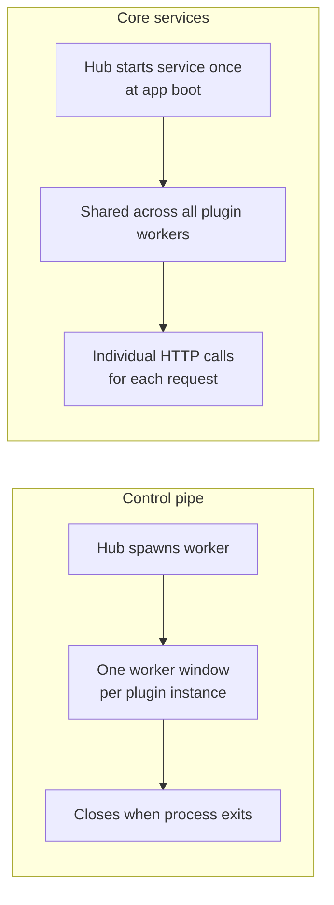
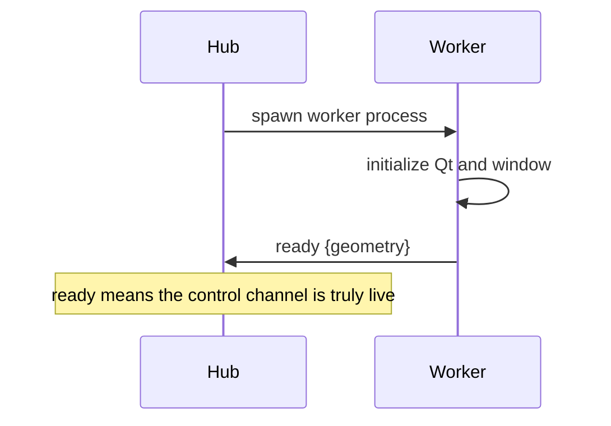
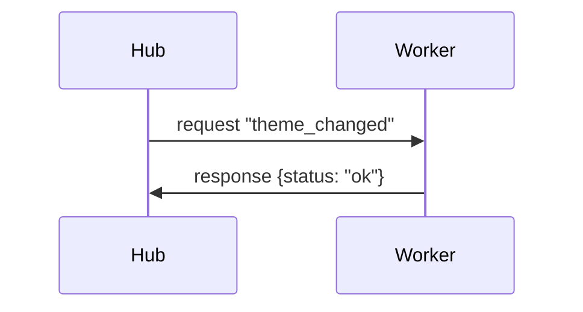
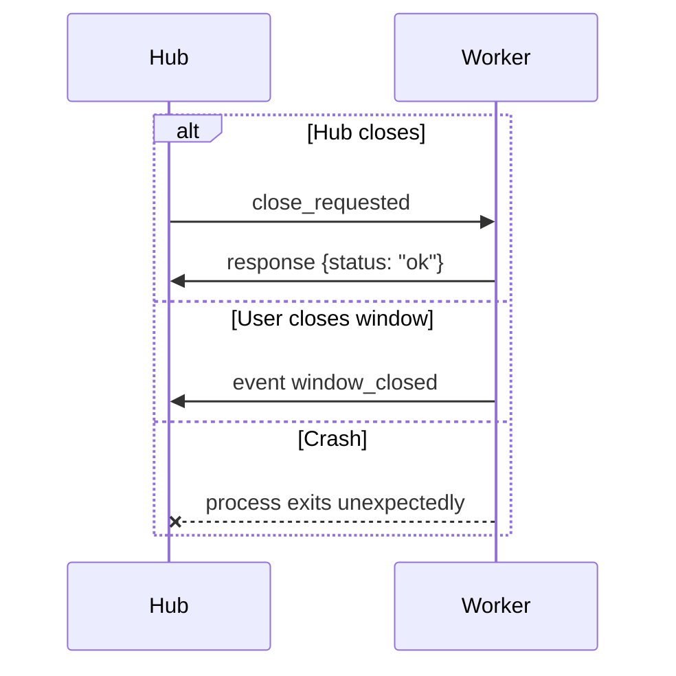
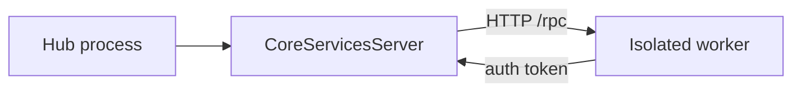

# Server / Client Lifecycle

This page explains the two communication lifecycles Karcytics uses when a plugin is isolated from the main app: the per-window stdio control connection and the Hub-wide loopback RPC service.

---

## Two connections, different lifetimes

Karcytics keeps two separate channels between the Hub and an isolated plugin:

The control pipe is per plugin window. The CoreServices server is shared for the whole Hub session.

---

## 1) The stdio control connection

This connection carries the worker lifecycle, requests, and event notices for a specific plugin window. It is the control plane for that single process.

### Opening the worker

When the Hub starts a plugin worker, it launches a subprocess with the plugin environment and a small set of environment variables for port and auth token. The worker then builds its Qt window and announces readiness.

### What travels on the pipe

The worker and Hub exchange framed msgpack payloads. The protocol is intentionally simple:

| Kind | Direction | Meaning |
|---|---|---|
| `request` | Hub → worker | invoke a method and wait for a reply |
| `response` | worker → Hub | reply to a request |
| `event` | worker → Hub | fire-and-forget lifecycle event |

The important rule is that Hub → worker communication is always a request/response flow. There is no direct “broadcast” path from the Hub into a running worker without a method call.

### Typical request cycle

A request might be a theme update or a workflow injection. The pattern is always similar:

This keeps the worker lifecycle and the UI update path explicit instead of relying on a hidden background stream.

### Closing the connection

A worker can close in a few ways:

1. **Hub-initiated close** — the Hub sends a close request and the worker exits cleanly.
2. **Worker-initiated close** — the user closes the native window directly.
3. **Crash or process death** — the pipe closes without a graceful reply.

This is why the Hub treats “PIPE closed” as a meaningful lifecycle signal rather than as an ordinary silent shutdown.

---

## 2) The CoreServicesServer

This is the Hub-wide RPC service that isolated plugins use when they need to reach host functionality. It is not tied to a single window; it is a shared service available for the life of the app.

### How it starts

At Hub startup, Karcytics starts a loopback HTTP server on `127.0.0.1` with a random free port and a generated bearer token. Each worker receives the port and token via environment variables.

### Why it exists

The stdio control channel is good for direct worker lifecycle events and request/response interactions tied to a window. But some operations must be Hub-global or shared across workers, such as:

* theme lookup and switching
* diagnostics reporting
* project information requests
* project data operations

Each call is its own authenticated HTTP request; there is no persistent session object for the worker to keep open.

---

## Lifecycle rules that matter

A few rules are worth remembering when working with isolated plugin lifecycles:

* **Hub → worker is request-driven** — use explicit RPC methods over the stdio pipe.
* **worker → Hub can be async** — fire-and-forget events are allowed when the worker needs to inform the Hub about a lifecycle event.
* **loopback services are shared and global** — they are not tied to a single plugin instance.
* **the pipe ends when the worker ends** — the Hub must interpret that as a lifecycle transition, not a generic transport error.

---

## Practical implications for contributors

When extending Karcytics, keep the lifetime boundaries clear:

* use the control pipe for window-scoped commands and shutdown signals,
* use the CoreServices server for shared host capabilities,
* never assume a worker stays alive beyond the current UI instance,
* treat a closed pipe or a dropped connection as a lifecycle event, not just a networking oddity.

---

## Related docs

* [Plugin Communication Protocol](24_Plugin_Communication_Protocol.md)
* [Event Bridging](28_Event_Bridging.md)
* [Core Architecture Overview](11_Core_Nervous_System.md)
