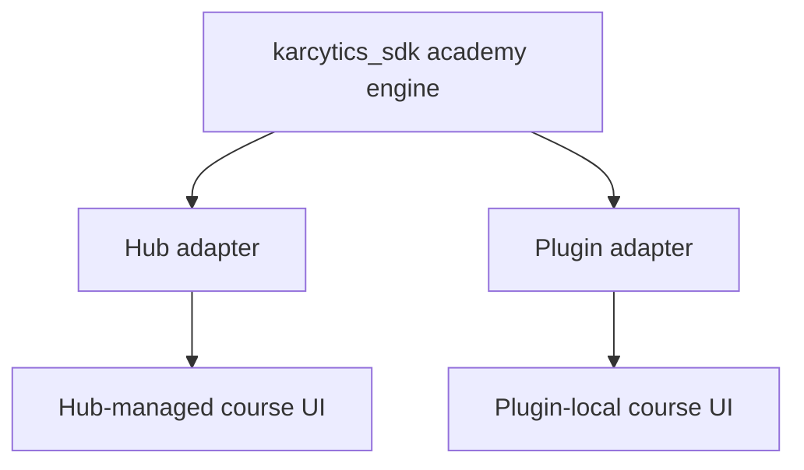
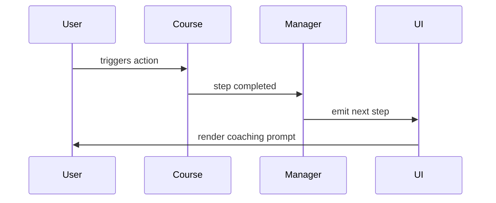

# The Academy Engine

Karcytics Academy is the in-app guidance system that powers onboarding, walkthroughs, and module-specific training. The important design decision is that the same course engine can run both in the Hub and inside isolated plugin processes.

---

## Why the engine is shared

Older implementations tended to keep academy logic in the Hub process only. That breaks down when modules run in isolated worker processes. The plugin process cannot depend on Hub-only code, so the course engine must live in the SDK layer and be adapted per runtime.

This is why the Academy engine is implemented as a shared class with process-specific adapters: one adapter for the Hub, one for the plugin runtime.



---

## One class, two adapters

The engine uses an event bus abstraction and a persistence directory. The runtime-specific adapter decides what “event bus” and “storage path” mean in that process.

```python
class AcademyEventBus(Protocol):
    def subscribe(self, topic: str, callback: Callable[..., Any]) -> None: ...
    def unsubscribe(self, topic: str, callback: Callable[..., Any]) -> None: ...
    def emit(self, topic: str, *args: Any) -> None: ...


class AcademyManager:
    def __init__(self, event_bus: AcademyEventBus, persistence_dir: Path) -> None: ...
```

That means both the Hub and the plugin process can use the same AcademyManager logic, even though they are backed by different event buses and different storage locations.

---

## Hub-side adapter

In the Hub process, the academy event bus wraps the real Karcytics event bus. Topic names resolve to the same event names used elsewhere in the app, so a course can react to a Hub-level state change without the academy system needing custom logic in every UI region.

```python
class _HubAcademyEventBus(AcademyEventBus):
    def subscribe(self, topic, callback):
        event_bus.subscribe(KarcyticsEvent[topic], callback)

    def emit(self, topic, *args):
        event_bus.emit(KarcyticsEvent[topic], *args)
```

This keeps the Academy engine tied to the same runtime semantics as the rest of the core.

---

## Plugin-side adapter

In an isolated plugin, the event bus is local to that plugin process. The plugin runtime needs its own adapter so academy progress and event watching remain sandboxed and do not leak across processes.

The plugin also gets a plugin-specific persistence directory so progress is stored under a unique path per plugin rather than sharing a single global academy file.

---

## Course authoring model

Courses are authored with typed step models. These are plain data objects that describe what the user is supposed to do next and what should happen when they succeed or fail.

Typical step types include:

* `InfoStep` — present information
* `ActionStep` — ask the user to trigger an action
* `InteractionStep` — wait for a specific UI interaction
* `VerificationStep` — check data or state
* `WaitForEventStep` — wait for an event to fire
* `BranchingStep` — choose a different route

Example:

```python
InteractionStep(
    id="c1_s3_import",
    text="Click Import Files to load your first sample.",
    target_widget_name="btn_import_files",
    event_trigger="clicked",
    next_step_id="c1_s4_review",
)
```

This keeps course design readable and portable across runtime environments.

---

## Rendering the course UI

The academy rendering layer lives in the SDK so isolated plugins can display the same coaching experience. The visual stack includes:

* the tutorial overlay
* the guided highlight/spotlight UI
* the Cyto mascot and coaching narration
* the course complete panel

This is not a stripped-down imitation; it is the same class model on both the Hub side and plugin side, with runtime-specific adaptation for styling and event handling.

---

## Event-driven progression

A course is not just a static list of steps. It reacts to user interaction and runtime state. The Academy manager emits events as the course advances, and the UI listens to those events to render the next step or complete the sequence.



This makes courses easier to author and easier to progress safely across different plugin implementations.

---

## Limitations and future work

A course can wait on Hub-level events only if the event is explicitly bridged into the plugin process. That is possible, but it is not automatic. In other words, the Academy system is shared, but not every event from the Hub is automatically visible to every plugin.

This is an intentional boundary: the engine is shared, but the event transport remains explicit and scoped.

---

## Related docs

* [Core Architecture Overview](11_Core_Nervous_System.md)
* [Plugin Communication Protocol](24_Plugin_Communication_Protocol.md)
* [Event Bridging](28_Event_Bridging.md)
* [Plugin Store & Security](../user/07_Plugin_Store_and_Security.md)
