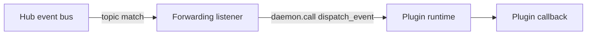
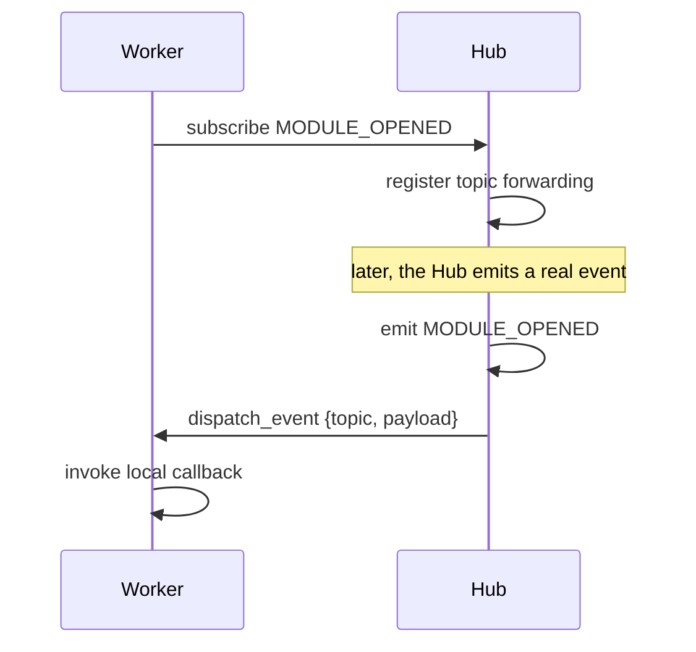

# Event Bridging: Hub → Isolated Plugin

Karcytics needs a way to forward selected Hub events into isolated plugin processes. This is not a global fan-out; it is a targeted bridge for topics that a plugin has explicitly subscribed to.

---

## Why event bridging exists

The Hub and an isolated plugin live in different processes, so they cannot share a single in-memory event bus. The plugin runtime can still listen for specific events, but the Hub must forward just those events over a controlled channel.

This keeps the system safer and more predictable than broadcasting every Hub event to every plugin.



---

## The design rules

The bridging model follows a few strict rules:

* plugin subscriptions are explicit
* subscriptions are per topic
* only subscribed plugins receive forwarded events
* the Hub side registers a forwarding listener only once per topic
* the worker side invokes local callbacks without crashing the rest of the process if one callback fails

This avoids the common mistake of broadcasting too much state to plugin workers that never asked for it.

---

## Worker side: `RemoteEventBus`

The worker-side event bus keeps a local registry of callbacks by topic and only calls the Hub to subscribe when the first local subscriber appears. Additional local subscribers for the same topic reuse the same remote subscription instead of creating redundant server calls.

```python
remote_event_bus.subscribe(KarcyticsEvent.MODULE_OPENED, my_callback)
```

When the plugin receives a forwarded event, it runs the subscribed callback locally. If one callback raises an exception, the runtime keeps processing the remaining callbacks instead of crashing the whole bridge.

---

## Hub side: registry and forwarding

On the Hub side, Karcytics tracks the set of plugin IDs that subscribed to each topic. Once a topic has any subscribers, the Hub adds a forwarding listener for that topic. When the real Hub event bus emits an event for that topic, the forwarding listener looks up the active plugin workers and dispatches the event to each one that subscribed.

This is a narrow bridge, not a broadcast to every worker.

---

## Worked example



This means a plugin can listen for relevant Hub-level events and react when those events happen, without the Hub having to know anything about the plugin’s internal logic.

---

## Why this is intentionally scoped

A blanket “mirror all Hub events into every worker” model would be simpler at first but would create several problems:

* unnecessary event traffic and serialization overhead
* leakage of Hub state the plugin did not ask for
* harder debugging when unrelated topics trigger plugin callbacks
* a bigger maintenance burden when more isolated plugins exist

So the bridge is topic-based and subscription-based by design.

---

## Practical guidance

If you are adding a new Hub event that isolated plugins should react to:

1. decide whether the event is truly meaningful to a plugin,
2. add an explicit subscription model if needed,
3. keep payloads minimal and documented,
4. avoid broad event fan-out unless there is a clear need.

This keeps plugin behavior understandable and reduces cross-process bugs.

---

## Related docs

* [Plugin Communication Protocol](24_Plugin_Communication_Protocol.md)
* [Server / Client Lifecycle](26_Server_Client_Lifecycle.md)
* [The Academy Engine](27_Academy_Engine.md)
