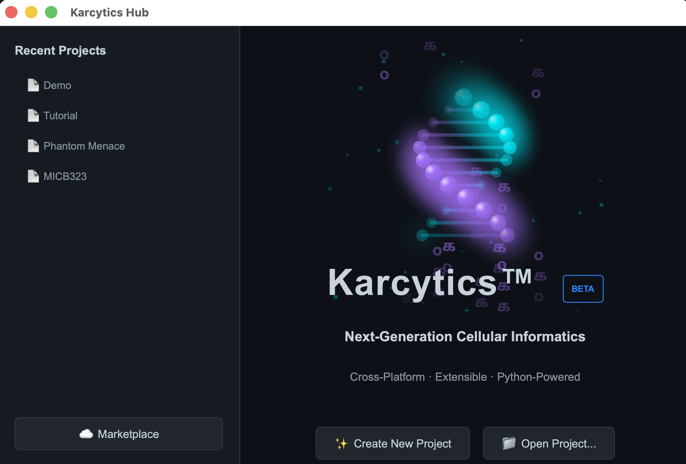
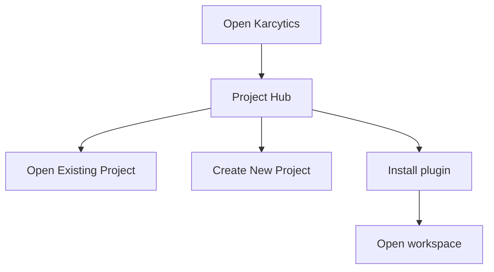

# Getting Started

This guide helps you launch Karcytics for the first time, create or open a project, and understand the key controls in the Project Hub.

---

## Before you begin

If Karcytics is not installed yet, start with [Installation](06_Installation.md).

Karcytics stores local app data in `~/.karcytics`. This includes:

* installed plugins
* trusted developer keys
* logs
* recent project metadata

---

## Launching Karcytics

1. Open Karcytics from your operating system’s app launcher or the extracted install folder.
2. On first launch, the app opens the **Project Hub**.
3. The Hub is the main starting point for new projects, existing projects, plugin installation, and help.

> [!NOTE]
> You can reopen the Hub from inside a workspace by choosing **File → Home Screen** or using the home button in the top toolbar.

---

## The Project Hub

The Project Hub has a few core areas:

* **Recent Projects** — a list of the project folders you most recently opened
* **Create New Project** — starts a new saved workspace
* **Open Project** — opens an existing project folder
* **Marketplace** — installs and manages analysis modules
* **Academy** — launches the guided onboarding experience

---

## Creating a new project

1. Click **Create New Project**.
2. Enter a project name.
3. Select a folder where the project should live.
4. Confirm the project creation.

Karcytics saves every project as a folder containing:

* `project.karcytics` — the main project state file
* `assets/` — images and files managed by the project
* `workflows/` — saved workflow snapshots
* `.karcytics.lock` — temporary lock file while the project is open

> [!WARNING]
> Do not open the same project in more than one Karcytics instance at once. This can lead to lock conflicts or data corruption.

---

## Opening an existing project

1. Click **Open Project**.
2. Navigate to the project folder that contains `project.karcytics`.
3. Select the folder and open it.

If another Karcytics instance is already using the project, the app will prevent a second open to avoid data corruption.

If Karcytics crashed and left a stale lock file, remove `.karcytics.lock` from the project folder before reopening—only after confirming no Karcytics instance is still using the project.

---

## Navigating the Help Center

Karcytics includes a built-in Help Center for offline documentation.

* Press **F1** from any workspace to open Help.
* Use **Help → Karcytics Help Center** in the app menu.
* Use **Restart Onboarding Tour** to replay the guided intro.

---

## Using Cyto Academy

Use the **Academy** button in the home ribbon or workspace toolbar to launch Cyto’s guided startup lessons.

* The startup course introduces the Project Hub, project files, and modules.
* If a lesson requires a plugin, Cyto prompts you to install it from the Marketplace.
* Academy is a safe place to learn workflows without affecting your main project.

> [!TIP]
> If you are new to Karcytics, start with the Academy tour before diving into a full analysis workflow.

---

## What comes next?

Once your project is open:

1. install the module(s) you need from the Marketplace,
2. follow the [Tutorial: First Analysis](03_Tutorial_First_Analysis.md), and
3. use the [FAQ & Troubleshooting](05_FAQ_Troubleshooting.md) page if something feels off.
