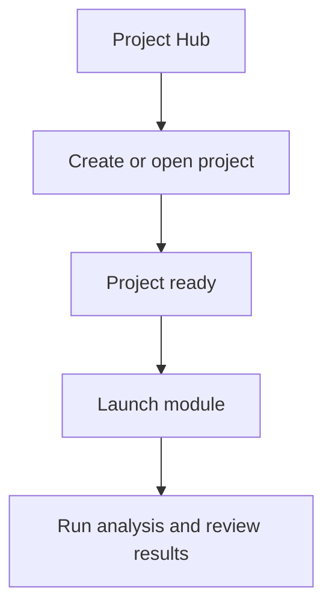

# Tutorial: First Analysis

This tutorial walks through a simple Karcytics analysis from opening a project to reviewing results.

---

## Step 1: Open or create a project

Start from the Project Hub:

1. Open a recent project, or click **Open Project**.
2. If you are new, click **Create New Project** and choose a project folder.
3. Verify the folder contains a `project.karcytics` file before continuing.

---

## Step 2: Choose a module

From the Home Screen, select an analysis module card.

* If the module is not installed yet, click **Marketplace** to install it.
* Installed modules appear in the Hub automatically.

> [!NOTE]
> If a module is blocked, untrusted, or outdated, Karcytics shows a warning and points you to the Plugin Store.

---

## Want a guided walkthrough?

If you want a more friendly ramp-up, open **Academy** and start the Cyto startup course before continuing with this tutorial.

Cyto walks through the same fundamentals in a training-friendly format.

---

## Step 3: Use the wizard flow

Many modules use a guided wizard interface. The standard flow is:

1. **Choose data** — select files, images, or other inputs
2. **Configure parameters** — adjust sliders, thresholds, and rules
3. **Run analysis** — execute the module and monitor progress
4. **Review results** — inspect output plots, tables, or visual summaries
5. **Export** — save results as CSV, images, or other supported formats

### Practical tips

* use the built-in file picker to locate input files;
* if the module reports validation errors, fix the data before continuing;
* keep the project organized as you move through each stage.

---

## Step 4: Explore the workspace view

Some modules open in a workspace-style view rather than a linear wizard.

In workspace mode, you will typically see:

* a top toolbar with project controls and navigation,
* side panels for assets, workflow status, and properties,
* a central canvas for your analysis or visualization.

This is useful when you want to iterate on settings or compare multiple outputs.

---

## Step 5: Use undo and redo

Karcytics preserves edit history for many modules.

* use **Ctrl+Z** on Windows or **Cmd+Z** on macOS to undo,
* use **Ctrl+Y** or **Shift+Ctrl+Z** to redo,
* the **Edit** menu includes undo and redo when a project is open.

> [!NOTE]
> The availability of undo/redo depends on the active module and workflow.

---

## Step 6: Close the project safely

When your work is complete:

* choose **Close Project & Return to Hub** from the workspace toolbar,
* Karcytics saves your project before returning to the Hub.

If the app closes unexpectedly, a stale `.karcytics.lock` file may remain. Remove it only when you are certain no other Karcytics instance is using the project.

---

## What comes next?

* [Plugin Store & Security](07_Plugin_Store_and_Security.md) — install modules and manage trust
* [Project Management](04_Project_Management.md) — understand how Karcytics stores and saves work
* [FAQ & Troubleshooting](05_FAQ_Troubleshooting.md) — diagnose problems and review logs
