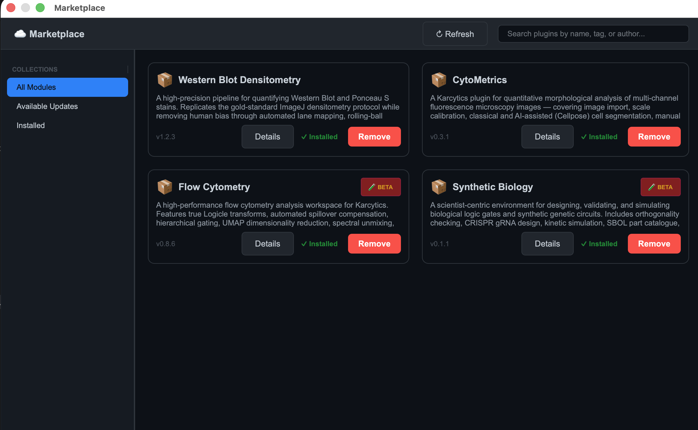
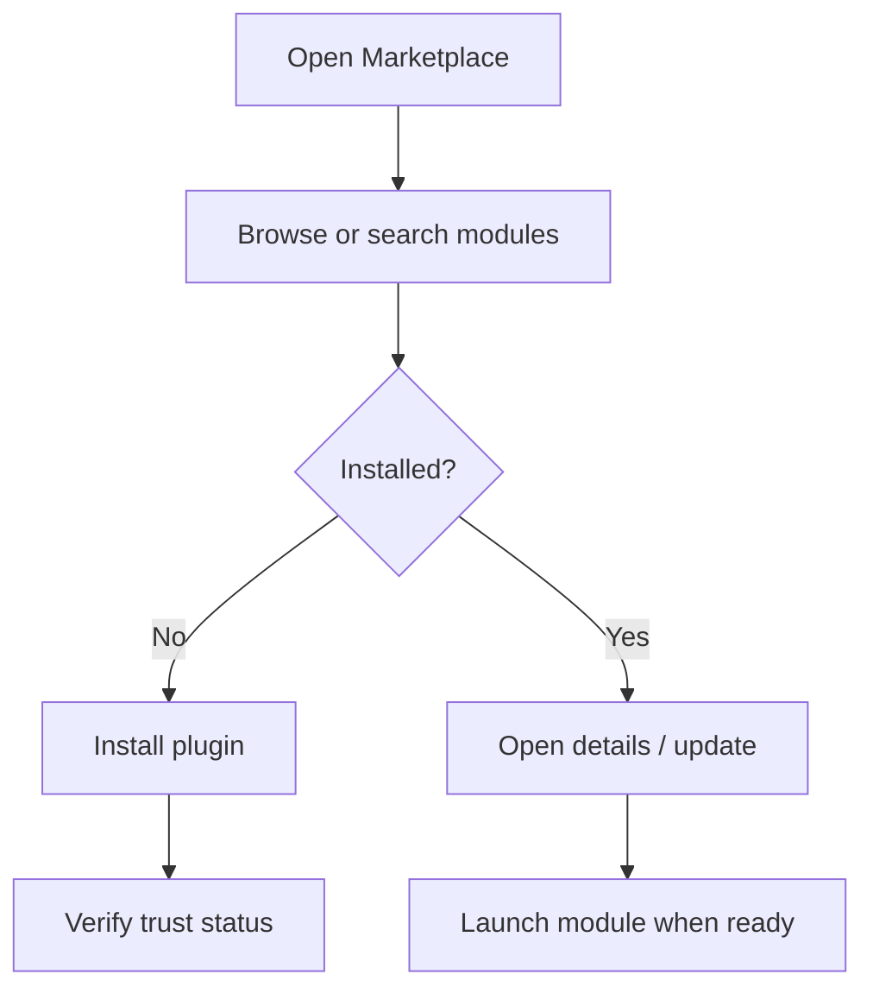

# Plugin Store and Security

Karcytics keeps the core app lightweight and lets you install analysis tools as needed. The in-app Plugin Store handles discovery, updates, and trust checks so you can add modules without manually copying files into the app.

---

## Why the Plugin Store matters

Karcytics separates the main application from analysis modules. That gives you:

* a smaller, more stable core app,
* a modular workflow where you only install what you need,
* safer plugin execution through trust checks and developer verification.

The Plugin Store is the place to manage all of this from a single interface.

---

## What you will see in the Marketplace

The Plugin Store organizes modules into a few clear views:

* **All Modules** — browse every plugin the registry knows about
* **Available Updates** — see modules with a newer version available
* **Installed** — review the plugins currently enabled on your machine
* **Trusted Developers** — see which publishers are already known and trusted

---

## Installing and updating plugins

1. Open the **Marketplace** from the Project Hub.
2. Search for a module by name, author, or category.
3. Open the module card to inspect version and publisher information.
4. Click **Install** to download and enable the plugin.
5. If an update is later published, reopen the Marketplace and choose **Available Updates**.

### How installation works

Installed plugins are stored in `~/.karcytics/plugins`.

* the remote registry provides metadata and package files,
* the Marketplace downloads and extracts the plugin,
* Karcytics records the selected version in a local install registry,
* the plugin becomes available from the project launcher or workspace.

> [!TIP]
> If a plugin package contains a single top-level folder, Karcytics will flatten it so the module still loads correctly.

---

## Security status explained

Every plugin receives a trust status when Karcytics discovers it.

* **Verified Secure** — the plugin is cryptographically valid and the publisher is trusted
* **Untrusted** — the plugin files are intact, but the developer is not yet trusted by a known authority or local approval
* **Outdated** — the plugin version is incompatible with the installed Karcytics core or depends on a newer release

If a plugin is blocked because it is untrusted, Karcytics shows a high-visibility warning before you can run it.

---

## Trust and developer identity

Karcytics keeps known trust anchors in `~/.karcytics/trusted_roots`.

When you inspect a plugin, you may see one of these trust paths:

* **Verified Root Trust Chain** — the developer key is validated through the official Karcytics trust chain
* **Manually Approved Root (Local Override)** — you approved the developer locally
* **Unverified Self-Signed Identity** — the plugin is present but no trusted path is available yet

### Approving an untrusted developer

When Karcytics asks you to trust a developer, review the name, key, and source carefully. If you recognize it and trust the publisher:

1. click **Trust this Developer**;
2. Karcytics saves the developer key locally;
3. that developer’s plugins can load normally in future sessions.

If you do not recognize the source or do not want to trust it, do not load the plugin.

> [!IMPORTANT]
> Only approve a developer if you trust the publisher and are comfortable with the module running code on your machine.

---

## Plugin details and diagnostics

Each plugin card includes details such as:

* publisher name and version
* minimum required Karcytics version
* verification badge
* trust path and developer identity

The Marketplace also has a **Diagnose & Repair** action.

* Use **Repair** to rebuild plugin state when files are missing or a trust check fails.
* Use **Repair All Plugins** if a broader reset is needed across installed modules.

---

## Keeping plugins up to date

Karcytics periodically syncs plugin metadata from the remote registry. The Marketplace uses that metadata to show updates or changes in publisher trust.

If a plugin stops loading after an update:

* check the plugin details and trust state,
* verify the developer identity,
* reinstall the plugin if necessary,
* re-approve the developer if the trust chain changed.

---

## When things go wrong

* If a plugin fails to install, confirm your internet connection and retry.
* If a plugin is blocked as untrusted, verify the source or remove it if you do not trust it.
* If a plugin reports missing dependencies, use the plugin repair action or reinstall it.

> [!NOTE]
> The Plugin Store is not a generic file browser. It manages verified Karcytics modules that follow the app’s dynamic plugin model.

---

## Next steps

* [Installation](06_Installation.md) — install the app and prepare your system
* [Getting Started](02_Getting_Started.md) — create or open a project
* [FAQ & Troubleshooting](05_FAQ_Troubleshooting.md) — solve plugin or startup issues quickly
