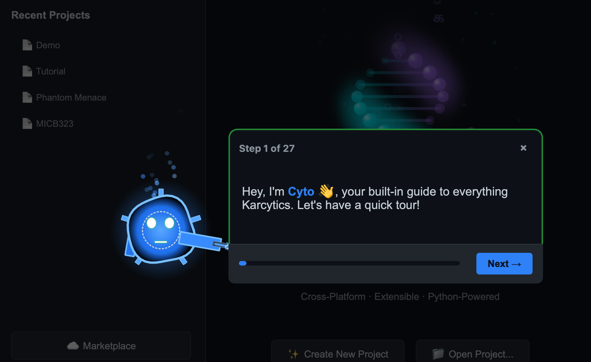

# Cyto Academy and Startup Guide

Karcytics includes an interactive learning experience led by **Cyto**, the app’s academy guide. Cyto helps new users learn the platform, discover workflow patterns, and complete a guided startup course inside the app.

---

## What is Cyto Academy?

Cyto Academy is Karcytics’s built-in onboarding and training workspace. It is designed for new users who want a guided introduction to the core platform and the most common analysis workflows.

* **Cyto** is the friendly mascot and guide character for the academy experience.
* **Courses** are organized around workflows, modules, and practical tasks.
* **Startup guides** introduce the Project Hub, Workspace, and plugin installation.

> [!NOTE]
> You can use Cyto Academy even after your initial setup. It is a good way to refresh your knowledge or explore a new analysis module.

---

## Launching the Academy

1. Open a Karcytics project or create a new one.
2. Click the **🎓 Academy** button in the workspace toolbar or from the Home Screen.
3. Choose a course or startup guide from the available list.

## What you will learn

Cyto Academy includes lessons such as:

* **Startup Guide** — learn how the Project Hub, project files, and module workflows fit together.
* **Module-specific courses** — follow guided lessons for individual analysis modules.
* **Project best practices** — understand safe project closing, backups, and sharing.

Each course is made up of step-by-step tasks that Cyto presents in the app. Progress is tracked locally so you can resume where you left off.

---

## Using the Startup Guide

The startup guide is the recommended first course for new users.

1. Follow Cyto’s prompts to open a project.
2. Install a sample module from the Marketplace if needed.
3. Explore the workspace layout and key controls.
4. Complete a simple example analysis.

## When to use Cyto Academy

Use the Academy whenever you want:

* a guided refresher on a feature you have not yet used,
* help understanding a new plugin’s workflow,
* a safe way to learn the app without affecting your main project data.

If a course requires a module you do not have installed, Cyto will prompt you to install it from the Marketplace.
